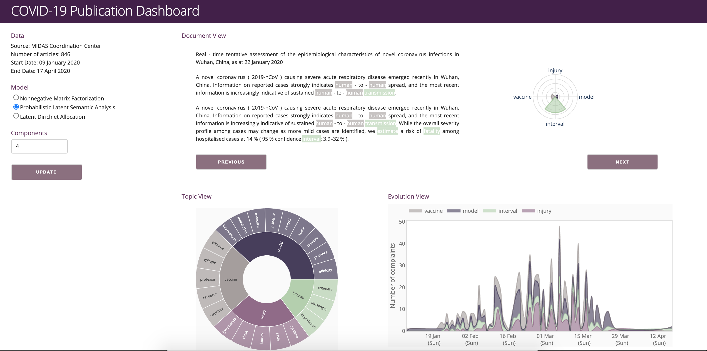

# COVID Publications Dashboard

This app was built with Plotly and Dash. For more details, see the [documentation](https://plotly.com/).



To run this app:

1. Clone the repository.

    ```
    git clone https://github.com/falakmasir/covid/.git
    cd covid/
    ```
    
2. Create and activate a new virtual environment (recommended).

    Windows
    
    ```
    virtualenv venv 
    \venv\scripts\activate
    ```
    
    Linux
    
    ```bash
    python3 -m venv myvenv
    source myvenv/bin/activate
    ```

3. Install the requirements.

    ```
    pip install -r requirements.txt
    ```
  
4. Install `spaCy` English model `en_core_web_lg`.

    ```
    python -m spacy download en_core_web_lg
    ```
     
5. Run the app.

    ```
    python app.py
    ```

6. Explore the notebook folder
